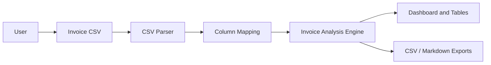

# System Overview

## Architecture

InvoicePulse AU is a client-side React application. It does not require a backend for the MVP.

## Module Responsibilities

| Module | Responsibility |
|---|---|
| `csvParser.ts` | Parses CSV and reports warnings |
| `fieldMapping.ts` | Defines canonical fields and auto-mapping aliases |
| `invoiceAnalysis.ts` | Implements business rules, overdue logic, ABN/GST checks, scoring |
| `reminderEmails.ts` | Builds reminder email drafts |
| `exporters.ts` | Builds downloadable CSV and Markdown outputs |
| `sampleData.ts` | Generates fictional dynamic sample CSV |

## Privacy Boundary

All analysis runs in the browser. There is no API call, database write, or file upload in the MVP.

## Future Integration Points

- Xero API import
- MYOB API import
- PDF export service
- Optional saved report history
- Optional AI-generated summary comments

