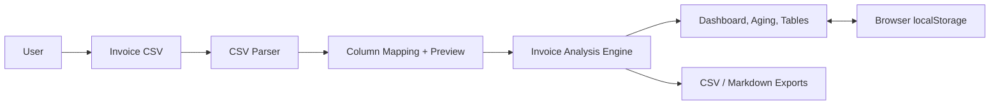

# System Overview

## Architecture

InvoicePulse AU is a client-side React application. It does not require a backend. Optional history features (reminder log, run-over-run snapshot, issue dismissals) use browser localStorage only.

## Module Responsibilities

| Module | Responsibility |
|---|---|
| `csvParser.ts` | Parses CSV and reports warnings |
| `fieldMapping.ts` | Canonical fields, exact-then-fuzzy auto-mapping, Xero/MYOB/QuickBooks preset detection |
| `format.ts` | Strict date parsing (day-first AU, no silent rollover), amount parsing (accounting negatives), display vs export money formatting |
| `invoiceAnalysis.ts` | Business rules: status token classification, overdue logic, due-date inference from terms, ABN/GST checks, aging buckets, weighted receivable age, scoring |
| `storage.ts` | On-device history: reminder log + tone escalation, analysis snapshot + run-over-run diff, issue dismissals |
| `reminderEmails.ts` | Builds reminder email drafts (friendly / firm / final) |
| `exporters.ts` | Builds downloadable CSV (cents-exact) and Markdown outputs |
| `sampleData.ts` | Generates fictional dynamic sample CSV |

UI components: `App.tsx` (flow: upload → mapping/preview → results), `components/Results.tsx` (dashboard, aging card, diff banner, follow-up table, issues table, email modal, mapping preview).

## Privacy Boundary

All analysis runs in the browser. There is no API call, database write, or file upload. Invoice file contents are never persisted. The only persisted data is on-device localStorage: reminder log, last-analysis snapshot (invoice numbers + outstanding amounts), and dismissed issues — documented in the data dictionary and clearable via browser storage settings.

## Quality Gates

- `npm test` — Vitest unit suites over parsing, mapping, business rules, storage, exports
- `tsc -b` — strict type checking
- GitHub Actions CI runs type check, tests, and a production build on every push/PR

## Future Integration Points

- Captured real Xero/MYOB/QuickBooks export samples to validate the modelled presets
- Xero API import
- MYOB API import
- PDF export service
- Configurable scoring weights
- Optional AI-generated summary comments
